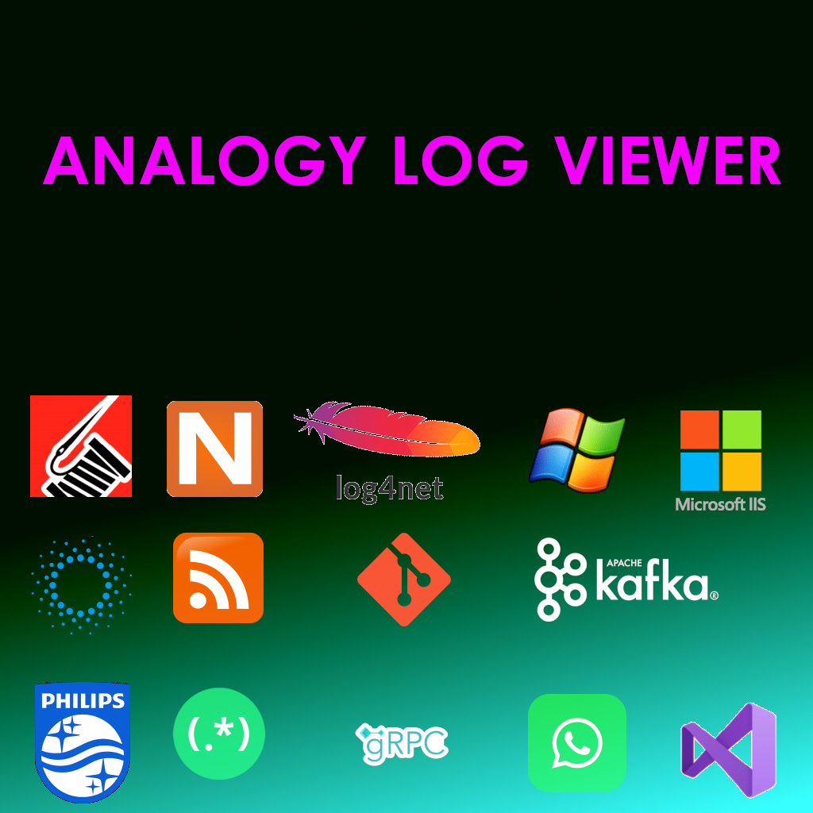
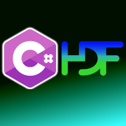
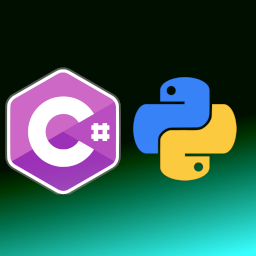
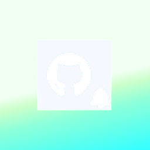

<!--

-->
<a href="https://www.linkedin.com/in/liorbanai" target="_blank">   </a>   

### Analytics ⚙️
<!--

-->

My Top Projects:
|| Project   |      Description      |
|:----------|:----------|:---------------|
|| [Analogy Log Viewer](https://github.com/Analogy-LogViewer/Analogy.LogViewer) | A customizable Log Viewer with ability to create custom providers. Can be used with C#, C++, Python, Java and others | 
|| [HDF5-Sharp](https://github.com/LiorBanai/HDF5-CSharp)| Set of tools that help in reading and writing hdf5 files for .net environments | 
|| [PythonNetWrapper](https://github.com/LiorBanai/PythonNetWrapper) | a library for executing pythonnet in C# projects | 
|| [Github Notifier](https://github.com/LiorBanai/GitHub-Notifier) | a small program that sits in the tray bar and periodically check repositories for activity |
|| [Popup Notification Windows](https://github.com/LiorBanai/Notification-Popup-Window) | A notification window that appears on the lower right part of the screen |

<!--
**LiorBanai/LiorBanai** is a ✨ _special_ ✨ repository because its `README.md` (this file) appears on your GitHub profile.

Here are some ideas to get you started:

- 🔭 I’m currently working on ...
- 🌱 I’m currently learning ...
- 👯 I’m looking to collaborate on ...
- 🤔 I’m looking for help with ...
- 💬 Ask me about ...
- 📫 How to reach me: ...
- 😄 Pronouns: ...
- ⚡ Fun fact: ...
-->
